# qmark

> Cisco-style `?` help, right in your terminal — with AI explanations in plain English.

[](https://github.com/Vitruvi0/qmark/actions/workflows/ci.yml)
[](LICENSE)


<p align="center">
  
</p>

If you have ever configured a Cisco device, you know the feeling: you type `?` and the CLI
tells you exactly what you can do next. `qmark` brings that experience to your everyday
terminal. Type a command, hit `?`, and get context-sensitive help — plus an `explain`
command that uses AI to describe what a command line does in easy English, before you run it.

> **Project status:** pre-alpha, under active development. APIs, commands and key bindings
> will change without notice. Not ready for production use.

## The project in 12 slides

Click any slide for full size — or read the whole deck as a [PDF](docs/qmark-deck.pdf). Source: [`docs/SLIDES.md`](docs/SLIDES.md).

<table>
  <tr>
    <td width="33%"><a href="assets/slides/slide.001.png">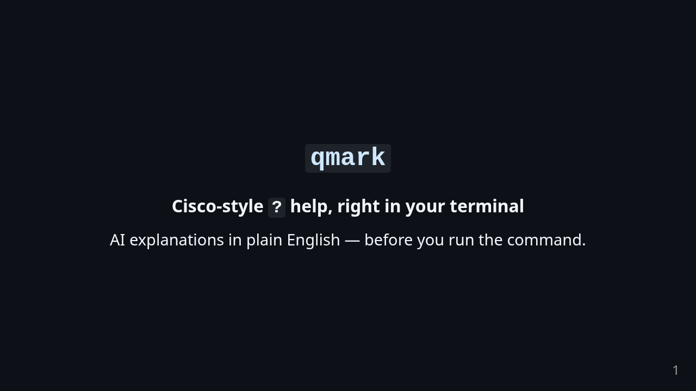</a></td>
    <td width="33%"><a href="assets/slides/slide.002.png">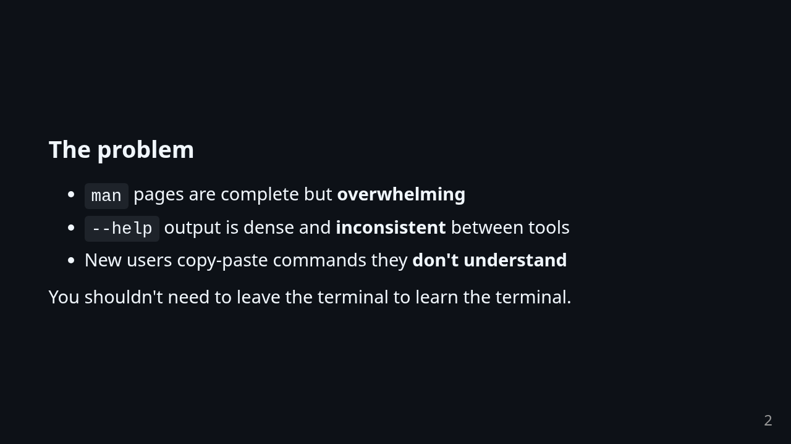</a></td>
    <td width="33%"><a href="assets/slides/slide.003.png">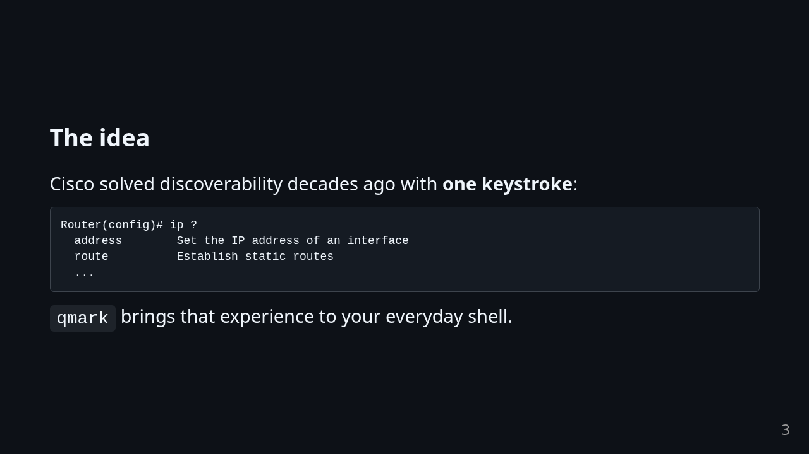</a></td>
  </tr>
  <tr>
    <td width="33%"><a href="assets/slides/slide.004.png">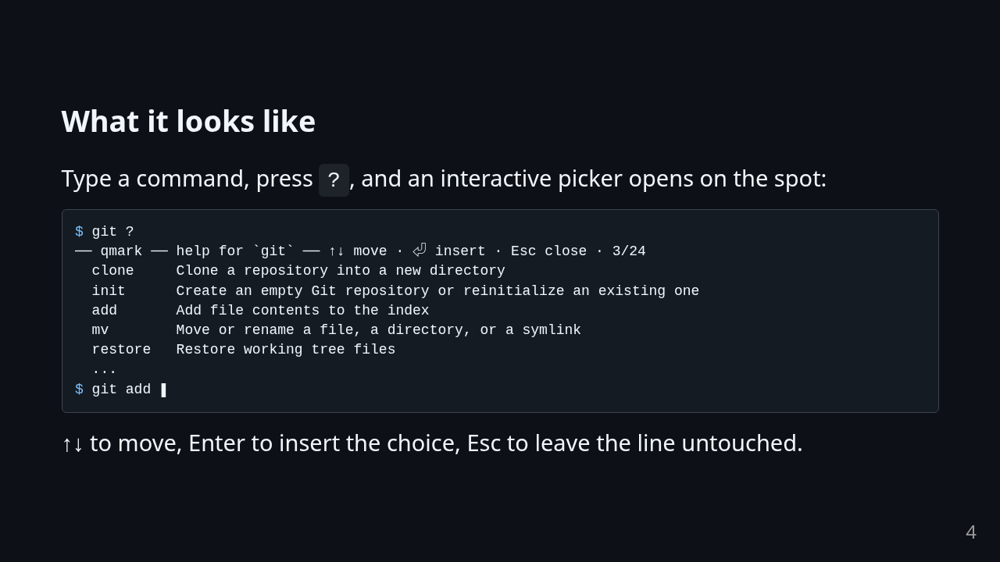</a></td>
    <td width="33%"><a href="assets/slides/slide.005.png">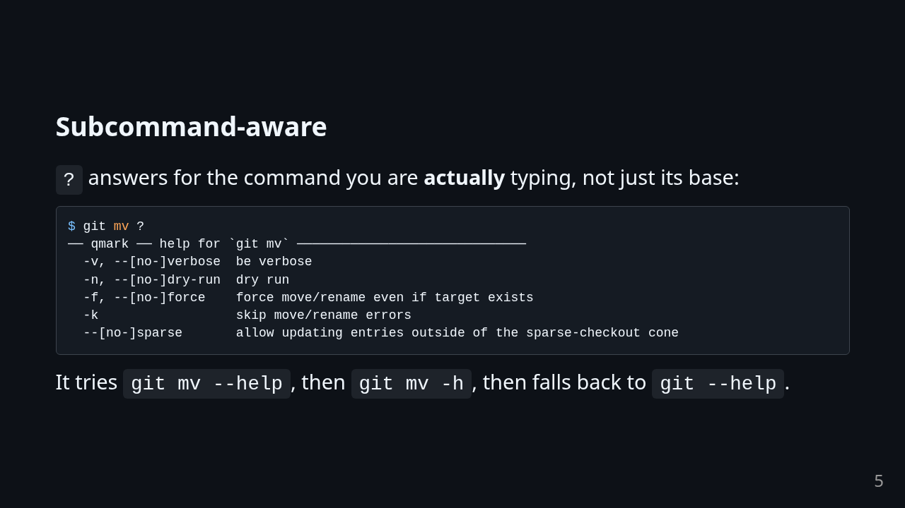</a></td>
    <td width="33%"><a href="assets/slides/slide.006.png">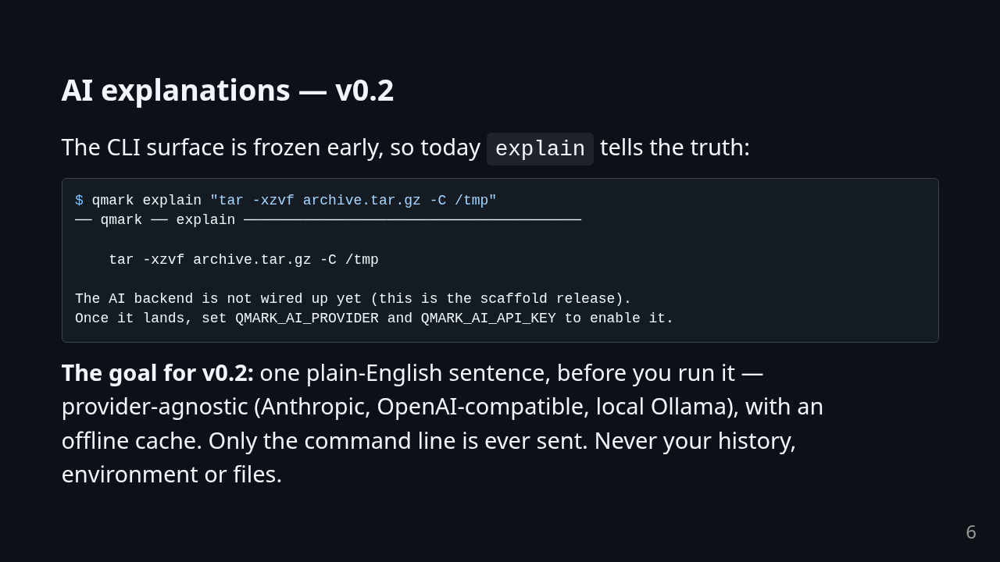</a></td>
  </tr>
  <tr>
    <td width="33%"><a href="assets/slides/slide.007.png">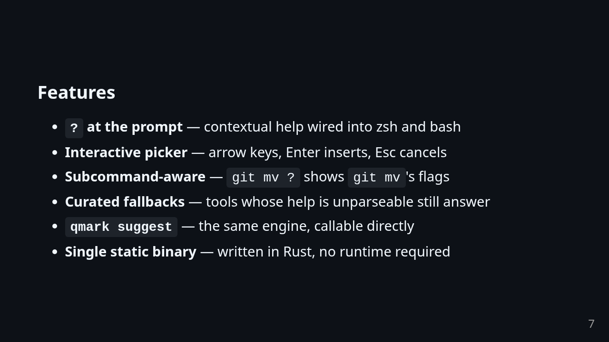</a></td>
    <td width="33%"><a href="assets/slides/slide.008.png">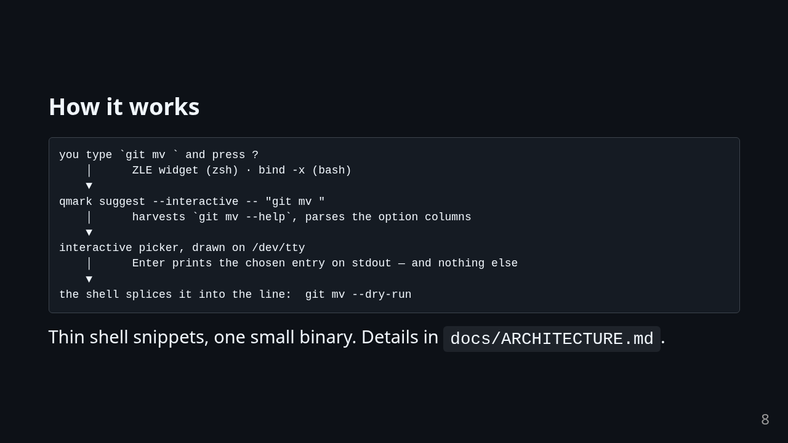</a></td>
    <td width="33%"><a href="assets/slides/slide.009.png">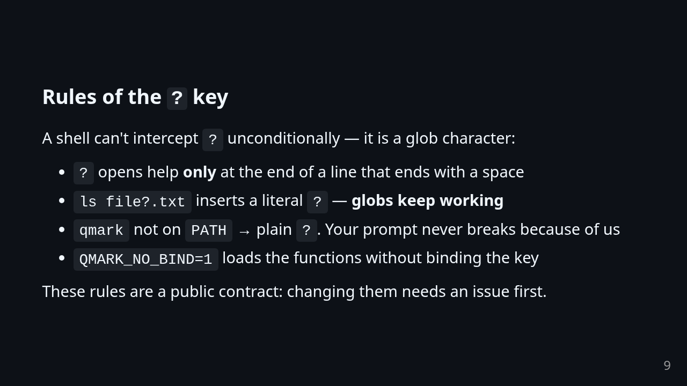</a></td>
  </tr>
  <tr>
    <td width="33%"><a href="assets/slides/slide.010.png">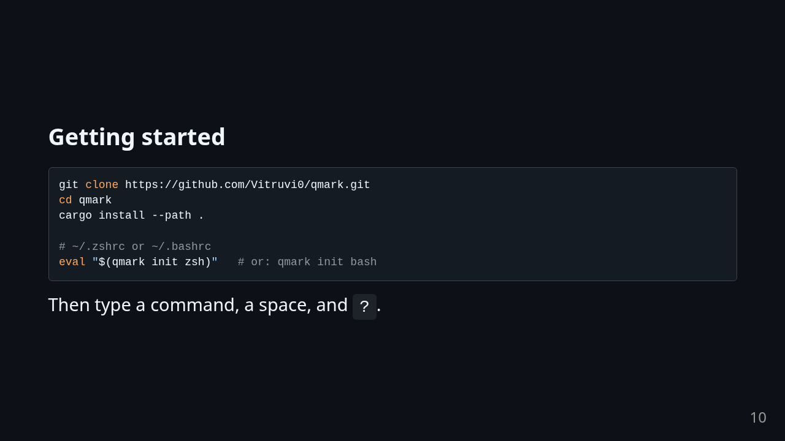</a></td>
    <td width="33%"><a href="assets/slides/slide.011.png">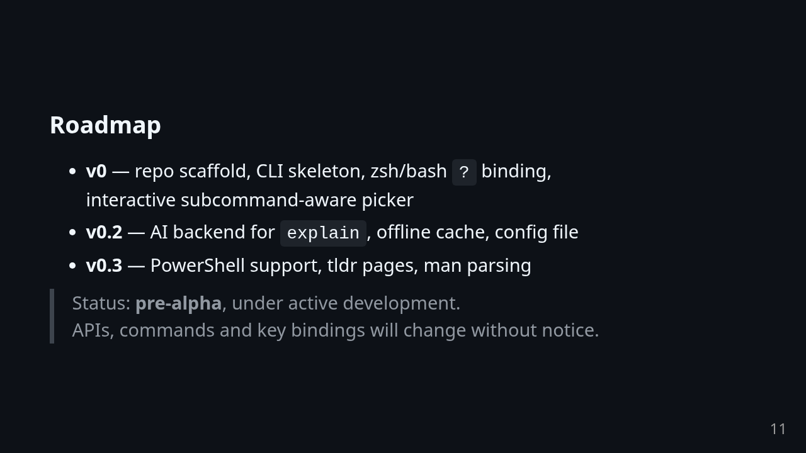</a></td>
    <td width="33%"><a href="assets/slides/slide.012.png">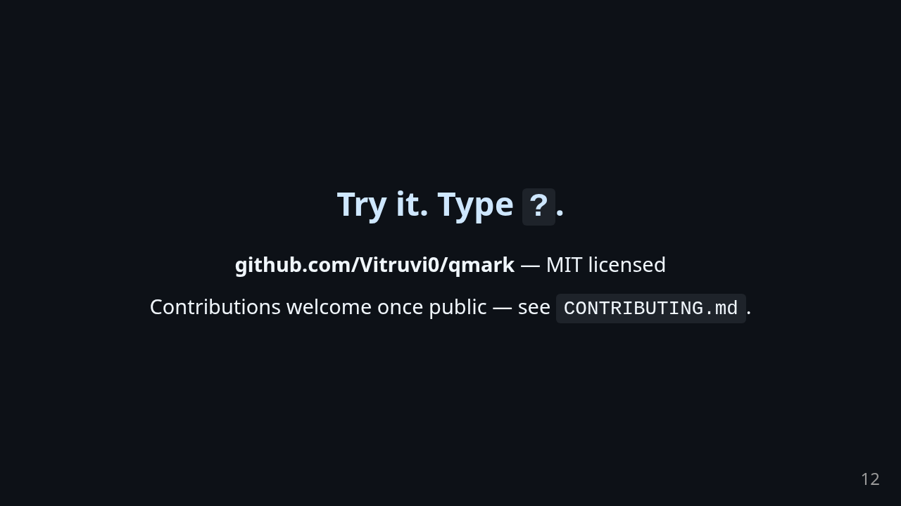</a></td>
  </tr>
</table>

## Why

- `man` pages are complete but overwhelming; `--help` output is dense and inconsistent.
- Cisco solved discoverability decades ago with a single keystroke: `?`.
- LLMs are very good at turning `tar -xzvf archive.tar.gz -C /tmp` into a sentence a human
  can read. There is no reason your shell should not do that for you.

## What it looks like

Press `?` after a space and an interactive picker opens on the spot (↑↓ to move, Enter to
insert, Esc to close) — that is the animation above. The same engine is subcommand-aware,
so it answers for the command you are actually typing:

```console
$ git mv ?
── qmark ── help for `git mv` ──────────────────────────────
  -v, --[no-]verbose  be verbose
  -n, --[no-]dry-run  dry run
  -f, --[no-]force    force move/rename even if target exists
  -k                  skip move/rename errors
  --[no-]sparse       allow updating entries outside of the sparse-checkout cone

Tip: `qmark explain "git mv"` gives a plain-English explanation (AI).
```

`explain` is a stub until v0.2 — the CLI surface is frozen early, on purpose:

```console
$ qmark explain "tar -xzvf archive.tar.gz -C /tmp"
── qmark ── explain ────────────────────────────────────────

    tar -xzvf archive.tar.gz -C /tmp

The AI backend is not wired up yet (this is the scaffold release).
Once it lands, set QMARK_AI_PROVIDER and QMARK_AI_API_KEY to enable it.
See docs/ROADMAP.md (v0.2) for the plan.
```

## Features

- **`?` at the prompt** — Cisco-style contextual help for the command you are typing,
  wired into your shell (zsh and bash in v1). The `?` stays visible on the line and an
  interactive picker opens; choosing an entry inserts it in place of the `?`.
- **Subcommand-aware** — `git mv ?` shows what can follow `git mv` (its flags), not just
  the generic `git` command list.
- **`qmark suggest`** — the same help engine, callable directly: pass any partial command
  line and get a readable summary of what it does and which options exist.
- **`qmark explain`** — AI-powered, plain-English explanation of a full command line.
  Designed for people who do not live in the terminal all day.
- **Single static binary** — written in Rust, no runtime required.

## Installation

Pre-built binaries are not published yet. Build from source:

```sh
git clone https://github.com/Vitruvi0/qmark.git
cd qmark
cargo install --path .
```

Requires a recent stable Rust toolchain (see `rust-toolchain.toml`).

## Shell integration

`qmark init` prints the integration snippet for your shell. Add one line to your rc file:

```sh
# ~/.zshrc
eval "$(qmark init zsh)"

# ~/.bashrc
eval "$(qmark init bash)"
```

After that, ending a command with a space and pressing `?` opens an interactive menu of
what can come next (↑↓ to move, Enter to insert, Esc to close). A `?` typed inside a word,
e.g. `ls file?.txt`, is inserted normally, so globs keep working.

## Usage

```console
qmark suggest "git"          # contextual help for a (partial) command line
qmark explain "rm -rf ./x"   # plain-English explanation (AI)
qmark init zsh|bash          # print the shell integration snippet
qmark --help                 # full CLI reference
```

## Configuration

Configuration lives in environment variables for now (a config file is on the
[roadmap](docs/ROADMAP.md)):

| Variable            | Purpose                                              |
| ------------------- | ---------------------------------------------------- |
| `QMARK_AI_PROVIDER` | AI backend for `explain` (not wired up yet)          |
| `QMARK_AI_API_KEY`  | API key for the AI backend                           |
| `QMARK_NO_BIND`     | Set to `1` to load the integration without the `?` key binding |

## How it works

A small Rust binary does the heavy lifting; thin shell snippets (a ZLE widget in zsh,
`bind -x` in bash) intercept `?` at the prompt and call the binary with the current line
buffer.

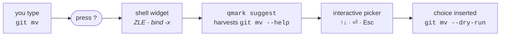

See [docs/ARCHITECTURE.md](docs/ARCHITECTURE.md) for the full design — the `?` binding
rules, the help-resolution ladder, and the AI provider plan.

## Roadmap

The full roadmap is in [docs/ROADMAP.md](docs/ROADMAP.md). Highlights:

- v0: repo scaffold, CLI skeleton, zsh/bash `?` binding, `--help`-based suggestions
- v0.2: AI backend for `explain` (provider-agnostic), offline cache
- v0.3: PowerShell support, richer help sources (tldr pages, man parsing)

## Contributing

Contributions are welcome once the repository is public. In the meantime, the workflow we
follow ourselves is documented in [CONTRIBUTING.md](CONTRIBUTING.md). Please also read the
[Code of Conduct](CODE_OF_CONDUCT.md).

## Security

See [SECURITY.md](SECURITY.md) for how to report vulnerabilities.

## License

[MIT](LICENSE) © 2026 Vitruvi0
