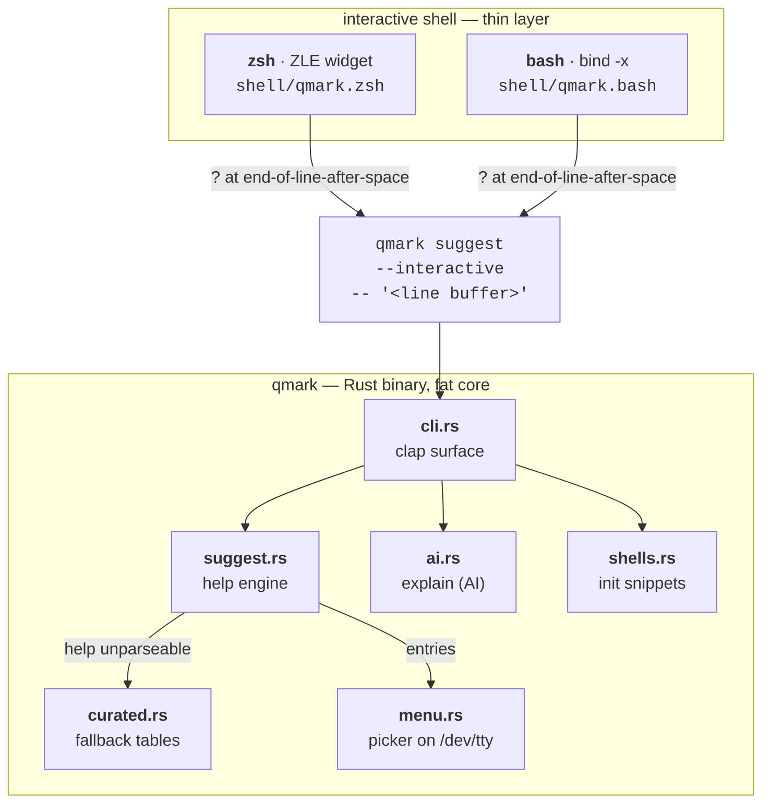
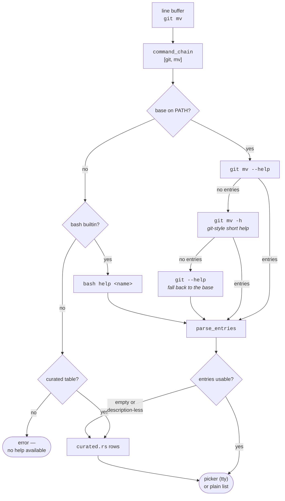

# Architecture

qmark is deliberately split into a **thin shell layer** and a **fat core binary**. Anything
that can live in Rust lives in Rust; the shell snippets only capture the `?` keystroke and
hand the current line buffer to the binary.

The arrows only go one way in the diagram because the return path is a single value: the
picker prints the **chosen entry, and nothing else, on stdout**, which the shell widget
captures with `$(...)` and splices into the line buffer. Everything the binary draws in
interactive mode — header, rows, highlight — goes to `/dev/tty` and stderr, so the capture
never swallows the UI and the UI never pollutes the capture.

## The `?` binding rules

Cisco intercepts `?` unconditionally; a general-purpose shell cannot, because `?` is a glob
character and a legitimate literal. v1 rules, identical in both shells:

1. `?` triggers help **only** when the cursor is at the end of the line **and** the line
   ends with a space — i.e. you type `git ` then `?`, like `git ?` on a router.
2. In every other position (`ls file?.txt`, mid-line edits, empty line) `?` self-inserts.
3. If `qmark` is not on `PATH`, the binding degrades to a plain `?` — the user's prompt
   must never break because of us.
4. `QMARK_NO_BIND=1` loads the functions without binding the key.

These rules are part of the public contract: changing them requires an issue + discussion
(see CONTRIBUTING.md).

## The suggest engine (v0)

`suggest` splits the raw line buffer into a command chain (`git mv ` → `[git, mv]`) and runs
the **deepest** help invocation that yields structured entries, so `git mv ?` answers with
`git mv`'s flags rather than the generic `git` subcommand list.

Every help invocation is hardened the same way:

- stdin is `/dev/null` so tools that read stdin cannot hang the widget;
- `PAGER`/`GIT_PAGER` are forced to `cat` so paged help cannot take over the terminal;
- stdout is preferred, stderr is used as fallback (BSD tools print usage there);
- the plain (non-picker) listing is capped with a pointer to the full `--help`.

Known limitations (tracked in ROADMAP):

- **No timeout.** A pathological `--help` that blocks would block the widget. A
  wait-with-timeout wrapper is planned.
- **Executes the target.** Harvesting help runs the target program by design — including
  `<base>  --help` for subcommand awareness. It is invoked directly (no shell
  interpolation) with a single fixed flag appended, but a malicious binary already on the
  user's `PATH` can obviously do anything — same trust model as typing the command
  yourself.
- **Parser-dependent.** Entries come from parsing help columns; tools with prose-style
  usage fall back to `curated.rs`, which is hand-maintained and therefore partial.

## The explain command (AI)

`explain` is an honest stub in v0 so the CLI surface is frozen early. The v0.2 design:

- a `Provider` trait (`fn explain(&self, line: &str) -> Result<String>`) with
  implementations for Anthropic, OpenAI-compatible endpoints and local models (Ollama);
- selection via `QMARK_AI_PROVIDER` + `QMARK_AI_API_KEY` (config file later);
- prompt fixed on "easy English, short, warn about destructive flags";
- **only the command line the user asked about is sent** — never environment, history or
  file contents (see SECURITY.md);
- an on-disk cache keyed by command line, so repeated questions are free and offline.

## Shell snippet distribution

`shell/*.{zsh,bash}` are the source of truth, embedded into the binary at compile time via
`include_str!`. `qmark init <shell>` prints them, so installation is one `eval` line in the
rc file and upgrading the binary upgrades the integration. CI runs shellcheck on the bash
snippet (zsh is out of shellcheck's scope).
