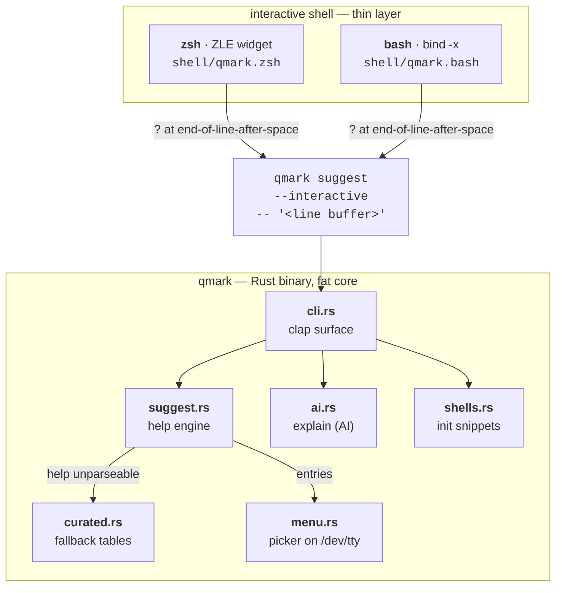
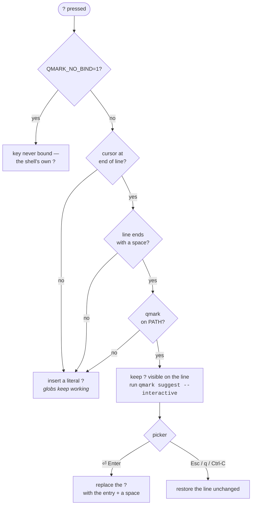
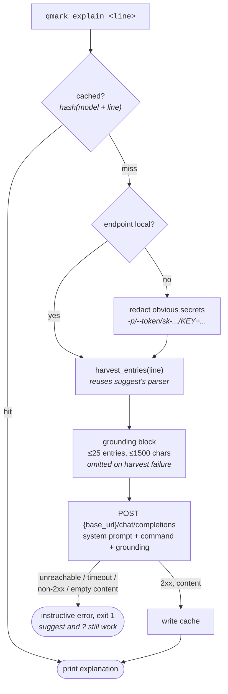

# Architecture

qmark is deliberately split into a **thin shell layer** and a **fat core binary**. Anything
that can live in Rust lives in Rust; the shell snippets only capture the `?` keystroke and
hand the current line buffer to the binary.

The arrows only go one way in the diagram because the return path is a single value: the
picker prints the **chosen entry, and nothing else, on stdout**, which the shell widget
captures with `$(...)` and splices into the line buffer. Everything the binary draws in
interactive mode — header, rows, highlight — goes to `/dev/tty` and stderr, so the capture
never swallows the UI and the UI never pollutes the capture.

## The `?` binding rules

Cisco intercepts `?` unconditionally; a general-purpose shell cannot, because `?` is a glob
character and a legitimate literal. v1 rules, identical in both shells:

1. `?` triggers help **only** when the cursor is at the end of the line **and** the line
   ends with a space — i.e. you type `git ` then `?`, like `git ?` on a router.
2. In every other position (`ls file?.txt`, mid-line edits, empty line) `?` self-inserts.
3. If `qmark` is not on `PATH`, the binding degrades to a plain `?` — the user's prompt
   must never break because of us.
4. `QMARK_NO_BIND=1` loads the functions without binding the key.

These rules are part of the public contract: changing them requires an issue + discussion
(see CONTRIBUTING.md).

## The suggest engine (v0)

`suggest` splits the raw line buffer into a command chain (`git mv ` → `[git, mv]`) and runs
the **deepest** help invocation that yields structured entries, so `git mv ?` answers with
`git mv`'s flags rather than the generic `git` subcommand list.

Every help invocation is hardened the same way:

- stdin is `/dev/null` so tools that read stdin cannot hang the widget;
- `PAGER`/`GIT_PAGER` are forced to `cat` so paged help cannot take over the terminal;
- stdout is preferred, stderr is used as fallback (BSD tools print usage there);
- the plain (non-picker) listing is capped with a pointer to the full `--help`.

Known limitations (tracked in ROADMAP):

- **No timeout.** A pathological `--help` that blocks would block the widget. A
  wait-with-timeout wrapper is planned.
- **Executes the target.** Harvesting help runs the target program by design — including
  `<base>  --help` for subcommand awareness. It is invoked directly (no shell
  interpolation) with a single fixed flag appended, but a malicious binary already on the
  user's `PATH` can obviously do anything — same trust model as typing the command
  yourself.
- **Parser-dependent.** Entries come from parsing help columns; tools with prose-style
  usage fall back to `curated.rs`, which is hand-maintained and therefore partial.

## The explain command (AI)

`explain` (`src/ai.rs`) is local-first: by default it talks to Ollama on `localhost`, and
nothing leaves the machine unless `QMARK_AI_BASE_URL` is pointed elsewhere on purpose. There
is **one wire format** — OpenAI chat-completions — not a `Provider` trait with multiple
implementations; Ollama, llama.cpp, LM Studio, vLLM and most hosted aggregators all speak
it, so one implementation covers local and remote without an abstraction that would have had
a single caller.

- **Grounding.** Before calling the model, `explain` resolves the command chain and harvests
  entries the same way `suggest` does (`suggest::harvest_entries`), so a small model is shown
  the real options of the real binary on this machine instead of recalling them from memory.
  Bounded to 25 entries / 1500 characters; a harvesting failure is non-fatal and the
  explanation proceeds ungrounded.
- **Cache.** `$XDG_CACHE_HOME/qmark/explain/<hash>.txt` (`~/.cache/...` fallback), keyed by
  model + command line via `DefaultHasher` — no crypto dependency, this is a convenience
  cache, not a security boundary. The first line of each file records the exact model and
  command line and is verified on read, so a hash collision is a miss, never a wrong answer
  served confidently. Written on success only.
- **Redaction.** Applied only when the endpoint is not local (not `localhost`/`127.0.0.1`/
  `::1`) — with the default Ollama setup there is nothing to redact. A token-wise scan
  strips password/token/API-key flag values, `sk-`/`ghp_`/`gho_`/`xoxb-`/`AKIA`-prefixed
  tokens, and the value half of `KEY=`/`TOKEN=`/`SECRET=`/`PASSWORD=`-style assignments.
- **Only the command line the user asked about is ever sent** — never environment, shell
  history or file contents (see SECURITY.md).
- **Model selection** (`src/ai/model.rs`) reuses the `?` picker (`src/menu.rs`): `qmark ai
  model` lists installed models (from `GET {base_url}/models`) alongside a curated download
  list; picking an uninstalled one confirms before running `ollama pull`. `qmark ai status`
  (`src/ai/status.rs`) reports the endpoint, resolved model and its source, reachability, and
  cache size.

## Shell snippet distribution

`shell/*.{zsh,bash}` are the source of truth, embedded into the binary at compile time via
`include_str!`. `qmark init <shell>` prints them, so installation is one `eval` line in the
rc file and upgrading the binary upgrades the integration. CI runs shellcheck on the bash
snippet (zsh is out of shellcheck's scope).
